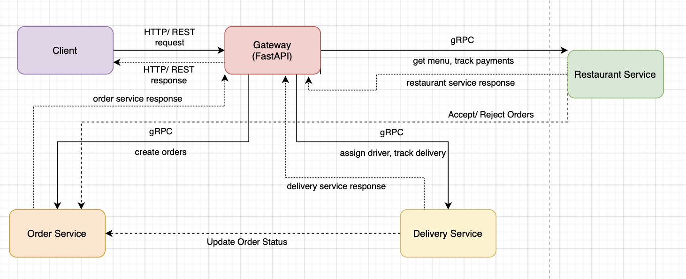

# Inspired Food Platform

Inspired Food Platform is a microservice-based food ordering and delivery application that connects customers, restaurants, and delivery drivers through a streamlined process.

## Overview

This system is composed of several services:
- **API Gateway**: Serves as the single entry point for external RESTful API calls and translates them into gRPC calls for internal communication.
- **Restaurant Service**: Manages restaurant details, menus, and payment tracking.
- **Order Service**: Handles order creation, order status updates, and contains embedded customer information.
- **Delivery Service**: Coordinates driver assignments and tracks delivery status.
- **Client Demo**: A script that simulates an end-to-end workflow to test system integration.

## Prerequisites
- Docker and Docker Compose
- Git

## Setup Instructions
1. **Clone the Repository**
   Open your terminal and run:

   ```bash
   git clone https://github.com/yourusername/inspiredfoodplatform.git
   cd inspiredfoodplatform
   ```

2. **Build and Run the Services**
   Use Docker Compose to build and start the services:

   ```bash
   docker-compose up --build
   ```

   This command will build all the Docker images and start the containers for the API Gateway, Restaurant, Order, Delivery services, and the Client demo.

## Running the Application

The client demo acts as an integration test that simulates a complete workflow. When you run the services:
- The client first checks the availability of the API Gateway.
- It then retrieves restaurant details (including menus) from the Restaurant Service.
- The client creates an order using customer details (name, email, phone) embedded directly in the order.
- The restaurant reviews and accepts/rejects the order.
- If accepted, the Order Service validates the order and computes the total.
- The Delivery Service is then engaged to assign a driver and track the delivery process.
- Finally, the client retrieves updated order details and restaurant payment information.

## Testing the Integration

The client script simulates the following steps:

1. **Retrieve Restaurant Information**
   - The client sends a REST request to the API Gateway to obtain restaurant details and the menu.
   - *Output:* Restaurant ID, name, address, status, and a list of menu items.

2. **Create an Order**
   - The client submits a new order with customer details, selected menu items, and delivery information.
   - *Output:* Confirmation of the new order including an order ID, status, and total amount.

3. **Restaurant Accept/Reject**
   - The restaurant reviews the order and decides whether to accept or reject it.
   - *Output:* Updated order status (CONFIRMED or REJECTED) and timestamp.

4. **Update Order Status**
   - If accepted, the client simulates the restaurant preparing the order by updating the order status.
   - *Output:* Updated order status and timestamp.

5. **Assign a Driver and Track Delivery**
   - The Delivery Service assigns a driver and tracks the delivery process.
   - *Output:* Delivery details such as driver assignment, current location, and estimated delivery time.

6. **Retrieve Final Order and Payment Details**
   - The client finally checks the order status and retrieves payment information from the Restaurant Service.
   - *Output:* Final order status and payment information.

Watch the logs in your terminal (or use `docker-compose logs`) to see messages from each service as the client demo runs through these steps.

## Troubleshooting
- **Container Issues**: Verify that all containers are running using `docker ps`.
- **Network Errors**: Ensure that no other process is using the required ports.
- **Logs**: Use `docker-compose logs [service_name]` (e.g., `docker-compose logs order_service`) to see detailed error messages.

## Architecture



## Testing Approach

### Integration Testing with client.py

The `client.py` script serves as a comprehensive **end-to-end integration test** for the entire system. Rather than using unit tests that verify individual components in isolation, this approach tests the complete user journey through all services, ensuring they work together correctly.

Key aspects of this integration testing approach:

1. **Real-World Flow Testing**
   - Tests the entire business process from restaurant discovery to order completion
   - Verifies the complete cycle: order creation → restaurant acceptance → preparation → delivery → completion
   - Ensures all services communicate properly in a production-like environment

2. **API Contract Validation**
   - Verifies that all service interfaces conform to their expected contracts
   - Tests both success paths and error handling
   - Ensures backward compatibility as services evolve

3. **System Orchestration Testing**
   - Validates that the API Gateway correctly routes requests to appropriate services
   - Confirms protocol translation works (REST ↔ gRPC)
   - Tests that service dependencies are properly managed

### Running the Tests

The integration test runs automatically when you start the services:

```bash
docker-compose up --build
```

You'll see the client container output showing each step of the testing process. A successful test will show:
- Successful connection to the API Gateway
- Restaurant information retrieval
- Order creation with customer information
- Restaurant order acceptance
- Order status updates
- Driver assignment and delivery tracking
- Final order status verification
- Restaurant payment retrieval

The test passes when you see "**Demo completed successfully!**" in the client container logs, and it exits with code 0.

If any part of the test fails, the client container will exit with a non-zero code, and you'll see error details in the logs.

This automated integration testing approach ensures that your entire system works correctly with a single command, making it easy to verify functionality after any changes.

## Bonus Challenge Implementation: API Gateway

### Challenge Description
For this project, I implemented the **API Gateway** bonus challenge. Instead of having clients call microservices directly, I introduced a centralized API Gateway that serves as the single entry point for all client requests.

### Implementation Details
The implementation includes:
- Using **FastAPI** to create a robust API Gateway service
- Implementing bi-directional protocol translation (REST ↔ gRPC)
- Creating routing logic to direct requests to the appropriate microservices
- Error handling and status code translation between protocols
- Unified endpoint structure for client applications

### Justification
Implementing an API Gateway provides several significant benefits:

1. **Centralized Entry Point**
   - Clients only need to know about one service (the API Gateway)
   - Simplifies client implementation and maintenance
   - Provides a single point for cross-cutting concerns like authentication

2. **Protocol Abstraction**
   - Internal services use efficient gRPC communication
   - External clients use familiar REST APIs
   - Best of both worlds: performance internally, compatibility externally

3. **Enhanced Security**
   - Single entry point makes it easier to implement security measures
   - Internal services are not directly exposed to the outside world
   - Better control over attack surface

4. **Simplified Client Integration**
   - Consistent REST API for all client platforms
   - Clients don't need to understand gRPC or Protocol Buffers
   - Easier integration with web and mobile applications

5. **Service Decoupling**
   - Services can be changed, replaced, or scaled independently
   - API Gateway can route to new service implementations transparently
   - Enables gradual migration and versioning strategies

The API Gateway pattern is particularly valuable in a microservice architecture like this food delivery platform, where it provides a clean separation between external clients and internal services while optimizing for both client developer experience and internal system performance.

## Final Notes

This integration demonstrates how the system works as a whole, ensuring that the API Gateway properly translates REST calls into gRPC calls and that all services interact as expected. The API Gateway implementation significantly improves the architecture by providing a unified entry point while allowing internal services to communicate efficiently.

Happy testing!